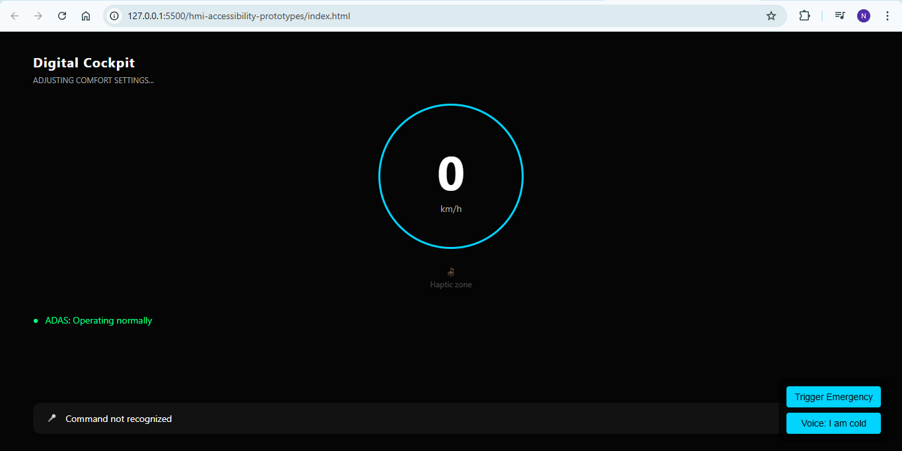
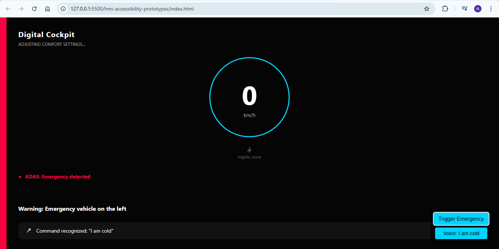

# Automotive HMI & Accessibility Research 🚗

This repository contains **web-based Proof of Concept (POC) simulations** focused on **Human-Machine Interface (HMI) design** and **Accessibility (a11y)** principles for **Software-Defined Vehicles (SDV)**.

The project demonstrates how **multimodal feedback**, **ADAS state visualization**, and **intent-based voice interaction** can improve **driver safety**, **situational awareness**, and **inclusive UX** in modern digital cockpits.

---

## 🖥️ HMI State Visualization

### SAFE State (Normal Operation)

- ADAS operating normally
- No active safety alerts
- Calm visual environment to minimize cognitive load

---

### DANGER State (Emergency Detected)

- ADAS state transitions to `DANGER`
- Directional ambient lighting highlights hazard location
- Multimodal alerting (visual + haptic)
- Critical HMI messaging overrides secondary information

---

## 🔹 Core Concepts Demonstrated

- Multimodal safety alerts (visual, haptic, ambient)
- ADAS state management (**SAFE → DANGER**)
- Priority-based HMI messaging
- Voice-driven comfort and accessibility controls
- WCAG-aware accessibility patterns adapted to automotive HMI contexts

---

## 🔹 Included POCs

### 1️⃣ Multimodal Safety & ADAS Alerts  
**(Haptic + Ambient Lighting + Visual HMI)**

- Emergency signal detection with **critical priority arbitration**
- **Directional seat haptic feedback** (left / right awareness)
- **Peripheral ambient lighting alerts** for hazard awareness
- ADAS **SAFE / DANGER state visualization**
- Screen-reader aware messaging using `aria-live`
- Explicit **HMI initialization to a known SAFE state**

👉 [Open Multimodal Haptic & ADAS Alerts POC](./haptic-alerts)

---

### 2️⃣ Intent-Based Voice Control & Accessibility  
**(Voice → Action → Feedback Loop)**

- Natural language → intent mapping (voice-to-command)
- Climate control and seat comfort simulation
- Visual confirmation on the HMI
- Text-to-Speech (TTS) fallback for accessibility
- Graceful error handling for unrecognized commands

👉 [Open Voice Control POC](./voice-control)

---

## 💻 How to Explore

- Each POC is fully **self-contained** with its own README
- Runs directly in the **browser** (no backend required)
- Console logs simulate vehicle subsystems (ECUs, CAN signals, TTS)
- Visual feedback is provided for all safety-critical and comfort-related actions

---

## ♿ Accessibility & HMI Philosophy

This project intentionally adapts **WCAG concepts to automotive HMI**, where:

- Not all information should be spoken continuously
- Critical alerts must override secondary feedback
- Motion respects `prefers-reduced-motion`
- Visual, haptic, and voice feedback **complement — not duplicate —** each other

---

## ⚠️ Disclaimer

This is a **conceptual prototype** intended for:

- HMI design exploration  
- Accessibility research  
- Portfolio and demonstration purposes  

It does **not** represent production vehicle software.

---

*Created as part of independent HMI & Accessibility engineering research, with a focus on safety-critical UX, inclusivity, and multimodal interaction in digital cockpits.*
